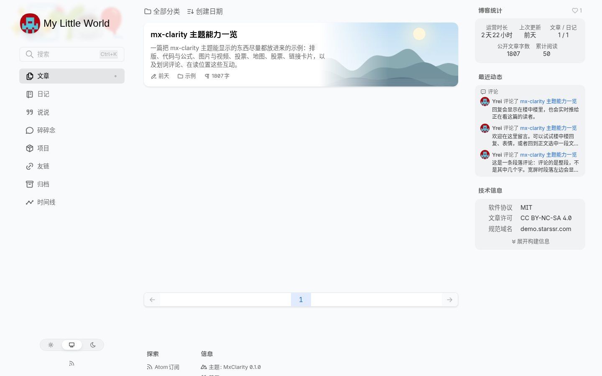
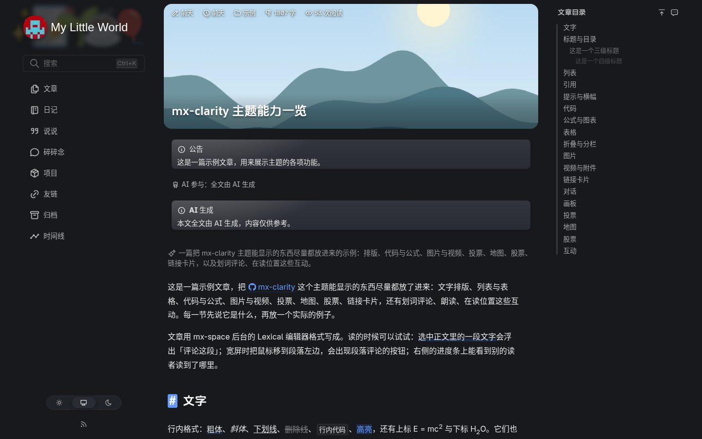
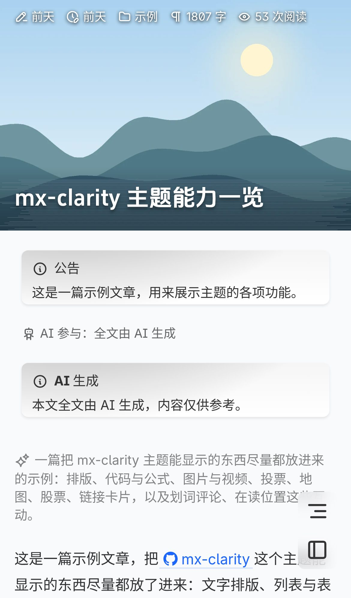

# mx-clarity

[mx-space](https://github.com/mx-space/core) 的博客前台主题：把 [L33Z22L11/blog-v3](https://github.com/L33Z22L11/blog-v3)（Clarity 主题，Nuxt 4）改造成 mx-space 的动态主题。
文章、日记、评论、友链、会员……全部来自 mx-space core，写作与管理都在 mx 的 admin 里做；主题只负责显示，版式沿用 Clarity。
像官方主题一样：用现成的镜像，只配 core 的地址，站点信息与主题配置都在 admin 里改，不用改代码、不用重新构建。
默认是中文站：向 core 取内容按中文（开了 AI 翻译时取中文译文）。在主题配置里开了多语言的，另有 `/<语言>/...` 的 AI 译文版，界面也换成那个语言。界面文字有中文、英文、日文、韩文，其余语言的前缀版用英文界面（见「主题配置」的 `i18n`）。

**演示站：<https://demo.starssr.com>**，跑的就是发布的镜像。里面有一篇[把主题能显示的东西尽量都放进去的示例文章](https://demo.starssr.com/posts/demo/mx-clarity-showcase)：排版、代码与公式、图片与视频、投票、地图、股票、链接卡片，还有划词评论。

<p>


</p>
<p></p>

## 和上游 blog-v3 的区别

| | blog-v3 | mx-clarity |
|---|---|---|
| 内容 | 仓库里的 Markdown（Nuxt Content） | mx-space core（在 core 14.13.0 上开发与验证） |
| 正文 | MDC | mx 的 Lexical 富文本与 Markdown 两条路径，渲染成同一套组件 |
| 评论 | Twikoo | mx 的评论：楼中楼、匿名与社交登录两种身份；排序、表情、读者改自己的评论、举报、按链接定位到某一条、划词评论（选中正文里的一段来评论）、新评论实时出现 |
| 运行方式 | 静态站 | Node 服务（SSR）：页面由主题渲染，匿名访客的页面整页缓存；页面上的评论、点赞、登录、实时连接由浏览器直接请求同源的 core（`/api/v3`、`/ws/web`，见下文「浏览器直连 core」） |
| 配置 | 改代码里的配置文件 | admin 里的站点设置与主题配置，不用重新构建（主题配置一分钟左右生效，站点设置十分钟左右：缓存过期后的下一次访问才换成新值；配了 webhook 就是立刻） |
| 新增 | | 日记、专栏、说说、碎碎念（赞 / 踩）、项目、时间线、实时在线人数与「正在阅读」（鼠标移到页脚的在线人数上，触屏点一下）、别的读者读到哪了、新文章提醒、点赞、付费文章与会员、草稿预览、邮件订阅、AI 精读与朗读、站长「此刻」与状态、多语言（中英日韩界面、AI 译文版、按浏览器语言跳转） |

## 页面

| 地址 | 内容 |
|---|---|
| `/`、`/archive` | 文章列表（侧栏只放统计、最近动态、技术信息，最近动态是最新的碎碎念与评论；上次来过之后发了新内容时提示一次）、归档（侧栏有阅读最多） |
| `/posts/:category/:slug` | 文章（付费文章锁定时只显示预览，接付费墙） |
| `/posts/:category`、`/posts/tag/:name`、`/posts/tag` | 分类（按年列出这个分类的文章，`/categories/:slug` 也转到这里）、标签、全部标签 |
| `/search?q=` | 搜索（也可以 Ctrl+K 弹窗搜） |
| `/notes`、`/notes/:nid`、`/notes/series` | 日记与专栏（加密日记要密码）；`/notes/年/月/日/slug` 这种日期地址 301 到 `/notes/:nid` |
| `/says`、`/thinking` | 说说、碎碎念（详情页可评论） |
| `/projects`、`/link`、`/timeline` | 项目、友链（可在线申请；被封禁的只在末尾留个名字）、时间线（`?type=post`、`?type=note` 只看文章或日记，`?memory=1` 只看标成「回忆」的日记） |
| `/membership` | 会员方案、我的会员状态、付费文章清单；登录的读者还有「我的评论」、停订途径与注销账号 |
| `/preview/:token` | 草稿预览（admin 里开的分享链接） |
| `/skills/:name` | 文章附带的 AI Skill（admin 里给文章配的 `SKILL.md`）：名称、说明、正文与「复制提示词」；附件经 `/skills/:name/<路径>` 转发 |
| `/:slug` | mx 的独立页（自动出现在侧栏导航里）。**slug 不要用语言代码**（`en`、`ja`、`ko`、`fr`、`de`、`es`、`ru`、`pt`、`it`）与上面这些地址的第一段（`skills`、`timeline`……）：会被占掉，也不进导航 |
| `/<语言>/...` | 主题配置 `i18n.languages` 开了的语言：每个页面都有这一版（草稿预览除外，如 `/ja/posts/tech/hello`）。界面文字跟着前缀：`/en` 英文、`/ja` 日文、`/ko` 韩文，其余语言用英文；内容取这个语言的 AI 译文。这一篇没有译文时留在这个地址，显示原文和一行说明，不让搜索引擎收录，canonical 指向原文地址；首页与列表的这一版也不让收录（`noindex`） |
| `/atom.xml`、`/says/atom.xml`、`/thinking/atom.xml` | 订阅源：文章与日记带全文（付费文章只有摘要），说说、碎碎念是纯文本。`/feed` 308 到 `/atom.xml`（从官方主题迁来的订阅地址） |
| `/sitemap.xml`、`/llms.txt` | 站点地图（含专栏与标签页）、给 AI 读的站点概览（文章、日记、页面） |

## 还没在真实环境里验证过

这些功能代码写好了、测试也覆盖了，但只在模拟的 core 上跑过，还没接真实的服务验证。用到的话请先自己走一遍，发现问题欢迎[提 issue](https://github.com/yreidev/mx-clarity/issues)：

- **读者社交登录**（GitHub 等 OAuth）的完整流程，以及 HTTPS 下 `__Secure-` 前缀 cookie 的表现。会话这一段只用站长的邮箱登录验证过。评论的读者身份、会员与购买、「我的评论」、屏蔽都建立在它上面
- **付费**：Dodo 的真实付款、订阅、单篇购买与停订，以及价格按最小货币单位换算（美元 `299` 显示成 US$2.99，日元不除）。只用构造的数据看过显示
- **AI**：摘要、精读、朗读与 AI 译文（多语言版）。演示站的 core 没开 AI，开了 AI 的 core 实际返回什么，没有实测
- **站长「此刻」**：没接真实的 companion 客户端测过
- **部署形态**：前面有 CDN 时还原访客 IP（见「反向代理」）、admin 用单独的域名（见「admin 用单独的域名」）

## 部署

后端（mx-space core）请自行部署，见 [mx-space 文档](https://mx-space.js.org/docs/deploy)。本主题只需要知道 core 的地址。

### 运行主题

core 用 docker compose 部署时（mx-space 官方的做法），把这一段加进同一个 compose（`app` 换成你的 core 服务名）：

```yaml
  mx-clarity:
    image: yreidev/mx-clarity:latest
    restart: unless-stopped
    ports:
      - 127.0.0.1:3000:3000
    environment:
      NUXT_MX_API_URL: http://app:2333/api/v3
    networks:
      - mx-space
```

`networks` 要和 core 所在的网络一致：官方的 compose 把服务都放在 `mx-space` 网络上；你的 compose 没有自定义网络时，删掉这两行。

单独用 `docker run` 时要注意：容器里的 `127.0.0.1` 是容器自己，连不到宿主机上只监听本机的 core。
core 在 docker 里的话，让主题加入 core 所在的网络（`docker network ls` 能查到），用服务名连：

```sh
docker run -d --name mx-clarity --restart unless-stopped \
  --network <core 所在的网络> \
  -p 127.0.0.1:3000:3000 \
  -e NUXT_MX_API_URL=http://<core 的服务名>:2333/api/v3 \
  yreidev/mx-clarity:latest
```

core 直接跑在宿主机上时，改用宿主机的网络，并让主题只监听本机（这时 `-p` 不起作用）：

```sh
docker run -d --name mx-clarity --restart unless-stopped \
  --network host -e HOST=127.0.0.1 \
  -e NUXT_MX_API_URL=http://127.0.0.1:2333/api/v3 \
  yreidev/mx-clarity:latest
```

| 环境变量 | 说明 |
|---|---|
| `NUXT_MX_API_URL` | **必填**。core 的接口地址，带 `/api/v3`；主题的服务端用它取数，填内网地址最快 |
| `NUXT_MX_CLIENT_IP_HEADER` | 访客 IP 从哪个请求头取：`x-forwarded-for`（默认，取最右段）或 `x-real-ip`（只有反向代理会覆盖它时才用） |
| `NUXT_PUBLIC_MX_AUTH_URL` | 读者登录的地址，默认 `/api/v3/auth`。必须与站点同源；只有反向代理把 core 的 `/api/v3/auth` 放到了别的路径时才要改 |
| `NUXT_PUBLIC_MX_BROWSER_API_URL` | 浏览器直连 core 的地址，默认同源的 `/api/v3`（实时连接走同一主机的 `/ws/web`）。只有反向代理把 core 的接口放到了别的路径时才要改 |
| `NUXT_PAGE_CACHE` | 匿名访客的整页缓存时长，秒，默认 `600`；`0` 关闭。带登录 cookie 的读者不走缓存；配了 webhook 时内容一改就清掉（见下文「内容改了立刻生效」） |
| `PORT`、`HOST` | 监听的端口与地址，默认 `3000`、`0.0.0.0` |
| `NUXT_CSP` | 页面的内容安全策略：`enforce`（默认，生效；`pnpm dev` 时默认 `report-only`，开发工具要读外站样式）、`report-only`（只在浏览器控制台报、不拦）、`off`（只留防嵌套这条最小的）。统计之类的脚本被拦、一时找不到原因时先改成 `report-only` |
| `NUXT_FRAME_ANCESTORS` | 除本站外还允许哪些站点用 iframe 嵌套页面，空格分隔的 `https://域名`。默认只许本站；admin 放在别的域名、又要在 admin 里嵌前台预览时填 admin 的地址 |
| `NUXT_MX_WEBHOOK_SECRET` | core 的 webhook 签名密钥。设了它，并在 admin 里配好 webhook，内容一改主题就清掉对应的缓存，不用等缓存过期（见下文「内容改了立刻生效」）；不设就不开这个接口 |
| `TZ` | 主题进程的时区，镜像默认 `Asia/Shanghai`。主题配置里没填 `timeZone` 时，站点时区就用它（见下文「主题配置」） |

镜像标签：`latest`（最新版本）、`1.2.3` / `1.2`（指定版本）、`edge`（`main` 分支的最新提交），只有 `linux/amd64`。同样的镜像也在 `ghcr.io/yreidev/mx-clarity`。自己构建：`docker build -t mx-clarity .`。
主题的缓存在进程内存里，**只跑一个实例**。

### 反向代理

照 mx-space 官方文档的「单域名」分流：站点、admin、core 的接口共用一个域名。在你的站点配置（`server` 块、证书自己配）里加上：

```nginx
# 写在 443 的 server 块里：只走 HTTPS（HSTS），不在错误页上报 nginx 版本
server_tokens off;
add_header Strict-Transport-Security "max-age=31536000" always;

# core：接口、实时通道、admin 面板
location /api/v3 {
	proxy_pass http://127.0.0.1:2333;
	proxy_set_header Host $host;
	proxy_set_header X-Forwarded-For $remote_addr;
	proxy_set_header X-Forwarded-Proto $scheme;
	# admin 上传图片走这里
	client_max_body_size 50m;
}
location /ws/ {
	proxy_pass http://127.0.0.1:2333;
	proxy_http_version 1.1;
	proxy_set_header Upgrade $http_upgrade;
	proxy_set_header Connection "upgrade";
	proxy_set_header Host $host;
	proxy_set_header X-Forwarded-For $remote_addr;
	proxy_set_header X-Forwarded-Proto $scheme;
	proxy_read_timeout 300s;
}
location /render {
	proxy_pass http://127.0.0.1:2333;
	proxy_set_header Host $host;
	proxy_set_header X-Forwarded-For $remote_addr;
}
location /proxy {
	proxy_pass http://127.0.0.1:2333;
	proxy_set_header Host $host;
	proxy_set_header X-Forwarded-For $remote_addr;
	proxy_set_header X-Forwarded-Proto $scheme;
}

# 主题
location / {
	proxy_pass http://127.0.0.1:3000;
	proxy_set_header Host $host;
	proxy_set_header X-Forwarded-For $remote_addr;
	proxy_set_header X-Forwarded-Proto $scheme;
	# 主题自己的接口请求体都很小，主题也拒绝 64 KB 以上的
	client_max_body_size 64k;
}
```

- **`Host` 要原样传**（不能是 `$proxy_host`）：core 的读者登录按它认站点地址（要在 `ALLOWED_ORIGINS` 里）。站点不在 80/443 上时改用带端口的 `$http_host`
- `/api/v3` 与 `/ws/` 不只给 admin 用：页面上的评论、点赞、登录与实时连接也由读者的浏览器直接发到这两个路径（见下文「浏览器直连 core」），都要按上面转给 core
- `X-Forwarded-For` 用覆盖（`$remote_addr`）或追加（`$proxy_add_x_forwarded_for`）都行：core 与主题都只取最右一段
- 前面还有 CDN 时，`$remote_addr` 是 CDN 节点的地址：用 nginx 的 realip 模块把它还原成访客 IP（`set_real_ip_from` 填 CDN 的回源网段，`real_ip_header` 填 CDN 放访客 IP 的那个头），上面的配置不用改。这种部署没有实测过
- `client_max_body_size` 按 location 分开设：`50m` 只给 `/api/v3`（admin 上传图片），不要写在 `server` 级，否则主题也跟着收 50 MB 的请求
- nginx 的 `add_header` 只在当前层没写任何 `add_header` 时才继承上一层：哪个 `location` 里加了自己的 `add_header`，就要把 HSTS 那行也抄进去。HSTS 只写在 HTTPS 的 `server` 块里；要不要 `includeSubDomains`、`preload` 是整个域名的决定，自己定
- 主题自己会给页面发内容安全策略（CSP：只有主题自己的脚本与它们加载的脚本能执行，见 `NUXT_CSP`）、防嵌套（`X-Frame-Options`、CSP 的 `frame-ancestors`）、`nosniff`、`Referrer-Policy`、`Permissions-Policy`；这些只在主题的响应上，admin 与 `/api/v3` 由 core 自己决定。不要在 `server` 级加 CSP，会盖到 admin
- core 的 `2333` 与主题的 `3000` 端口都只给反代访问，不要对公网开放：它们都信任直连方给的 `X-Forwarded-For`，直连就能伪造访客 IP（绕过限流、刷赞）。用 Docker 映射端口时绑 `127.0.0.1`，Docker 映射的端口不受防火墙的放行规则约束
- core 的环境变量 `ALLOWED_ORIGINS` 要包含站点域名，否则读者与 admin 登录会被拒
- 前面有 CDN 时：主题的页面对不带前缀的地址按浏览器语言跳转（回应带 `Vary: Accept-Language, Cookie`），CDN 要么不缓存页面（HTML），要么按这两个头区分缓存；`/api/v3` 与 `/ws/` 不要让 CDN 缓存

### 浏览器直连 core

页面由主题渲染，匿名访客的页面整页缓存（`NUXT_PAGE_CACHE`，默认 10 分钟，配了 webhook 时内容一改就清掉）。页面到了浏览器以后，评论、点赞、投票、订阅、搜索弹窗、友链申请、读者登录与会员、站长在前台的操作、AI 朗读和实时连接，都由读者的浏览器直接请求同源的 core（`/api/v3`、`/ws/web`）；正文渲染、列表、站点与主题配置、AI 精读仍由主题的服务端取。

这样页面便宜、能缓存。代价是 core 的公开接口返回什么，读者的浏览器就拿到什么，页面上不显示，但打开浏览器的开发者工具就看得到：

- 公开的评论接口带着每位评论者的 IP、浏览器标识和登录读者的邮箱；
- 实时连接里，新评论的推送带着评论者的明文邮箱，阅读位置的推送带着每位读者的会话 id；
- 公开的 GET 接口按网址缓存 15 秒，「我赞过」「我投的哪一项」这类因人而异的字段可能串给别人（主题取投票状态时带时间戳绕过了这层缓存）。

这些是 core 公开接口本身的行为。在意评论者隐私的站点，在 core 修掉之前请斟酌是否开放评论。

### 在 admin 里设好

1. **设置 → 网站设置**：`webUrl`、`wsUrl` 填 `https://<站点域名>`；`serverUrl` 填 `https://<站点域名>/api/v3`（要带 `/api/v3`：上传的图片地址由它拼成 `…/objects/…`，读者登录的回调地址也由它拼成，见下面「admin 用单独的域名」）；`adminUrl` 填 `https://<站点域名>/proxy/qaqdmin`
2. **设置 → SEO**：标题、描述、图标就是站名、站点描述与站点图标（新实例的标题默认是「My Little World」）
3. **主人信息**：名字与头像就是页面上的作者与侧栏头像；「社交账号」里的 GitHub、X（Twitter）、哔哩哔哩、知乎、微博、Telegram、豆瓣、Instagram、Steam、YouTube、邮箱会接在侧栏底部的图标后面（只填账号或数字 id，主题自己拼地址）；「一句话介绍」在主题配置没写 `subtitle` 时当副标题
4. **评论**：站点没有公开可见的日记时（没有日记，或只有未发布、加密、定时公开的），admin 评论设置里的「全站关闭评论」与「允许游客评论」对主题都不生效：主题照常显示评论表单（按 core 的默认允许匿名），读者发送时 core 按你的设置拒绝。写一篇公开日记后恢复正常
5. **主题配置**：见下一节
6. **评论与账号**：
   - 读者在评论发出后 10 分钟内能改自己的评论（站长的评论请在 admin 里改）。**core 不会重新审核改过的内容**：开了「只显示已审核评论」的站点，改过的正文也会立刻经 core 的实时连接推给在线的人
   - 登录读者能「屏蔽此人」（同时举报那一条）：之后看不到那位登录读者的评论。**core 没有解除屏蔽的接口**，读者自己撤销不了，要撤销得你在数据库里删；游客的评论不能屏蔽
   - 你登录后在前台：顶层评论能「置顶 / 取消置顶」，任何人的评论都能改（不限时间）；侧栏底部有「控制台」；配了 `ownerStatus.fn` 时侧栏的状态那一行能直接「设置状态」（表情、一句话、有效期，也能清除）
   - 读者能举报评论。core 只在一条评论第一次被举报时给你推一条 Bark，举报不进数据库：没配 Bark 又不在后台就收不到。举报由读者的浏览器直接发给 core，core 对同一条按读者或 IP 去重 90 天，主题不另外限次：有人换着评论举报，每条的第一次都会推给你
   - 评论里的图片只显示存在站点自己的：core 本地存储时是 `serverUrl` 下的 `/objects/image/`（上面第 1 步填好就行），存到 S3 自定义域名时把域名写进主题配置的 `comments.imageHosts`；别处的图片只显示成链接。评论区暂不提供上传图片（core 14.13.0 不会把上传的图片绑到评论上，约两小时后就删掉）
   - IP 归属地：admin 评论设置里开着「公开显示归属地」时，游客评论显示「来自 某地」；关掉后新评论不再写，老评论的照样显示
   - 读者可以在会员页注销账号：会员记录与买过的文章一并删掉，评论保留。还在自动续费的会员会被拦下，请他先去支付平台停订（core 删号时不会通知支付平台，扣款不会停）。站点域名要在 core 的 `ALLOWED_ORIGINS` 里，否则注销会被拒
   - 带 `#comment-<id>` 的链接会打开评论区并定位到那一条（「我的评论」里的链接就是这样）
   - 划词评论：Lexical 文章与日记里，在一段（段落、标题、引用、列表）里选中文字，会浮出「评论这段」，评论顶上带着引用，正文里被评论过的文字画下划线，鼠标停在上面会弹出这段评论的预览，点了看完整的讨论、回复。core 不检查引用是不是原文，主题按匿名取到的正文核对、重算位置，对不上的发不出去（选区跨过公式、提及、脚注这类特殊内容时也对不上）；付费文章锁住的部分、草稿、加密日记都不能划词评论。原文后来改掉了的，评论上只写「引用的内容已不在原文中」
   - 别人刚发的评论会实时出现在评论区里、标「新」（只显示这一篇的、公开的评论）。开了「只显示已审核评论」时，**登录读者的评论会先推出来**（core 的规则），刷新后才按审核状态显示
7. **正文里的富内容**（Lexical 编辑器里插的块）：
   - 投票：读者在文章里直接投，登录的读者按账号、游客按 IP 算一票；投了不能改、也不能撤回。**匿名投票防不住刷票**（有人直连 core 换着浏览器标识就能多投），重要的事别用它。加密日记、草稿预览里的投票不能参与（core 找不到它们）
   - 股票：行情由主题的服务端向 core 的内置云函数要（快照用 Twelve Data、K 线用 Polygon，key 配在 admin 的第三方服务里），嵌进页面；读者的浏览器不和行情服务通信。这几个内置函数在 core 上是公开的，不用股票块就别配这两个 key，免得额度被别人用掉。K 线上移动鼠标或手指看每一根的开高低收与成交量；快照带 52 周区间
   - 地图：滚到地图块时加载可拖动、缩放的交互地图（[MapLibre](https://maplibre.org)，桌面按住 Ctrl / ⌘ 用滚轮缩放、手机双指），底图是 [OpenFreeMap](https://openfreemap.org) 的，跟着站点深浅色。**读者的 IP 与正在看的区域会发给 `tiles.openfreemap.org`**。地点点开是小卡片（带 OpenStreetMap 链接），轨迹里停留 10 分钟以上的地方画成小圆点。加载前、加载不了时（没有 WebGL、瓦片取不到）是服务端画的示意图；地点清单一直列在下面。轨迹文件由主题的服务端取，只从站点或 core 的地址取，读者的浏览器不连它
   - 视频：B 站、YouTube 等平台的视频嵌入对方的播放器，滚到附近才加载，加载后读者的浏览器会连这些平台。YouTube 用隐私增强模式（`youtube-nocookie.com`），点播放之前不设 cookie、不请求广告域名
   - GitHub 文件与 Gist：单独成段的 `github.com/<所有者>/<仓库>/blob/<分支>/<路径>`（可带 `#L10-L20`）或 `gist.github.com/<用户>/<id>` 链接，由主题的服务端取来画成带文件名与行号的代码块（最多 200 行，文件 256 KB 以内，缓存一天），下面是「在 GitHub 上看」；读者的浏览器不连 GitHub。取不到（GitHub 对匿名调用限每小时 60 次）就照旧是链接
   - markdown 文章里 core 写成 `<node type="stock|map" data="…" />` 的块（Lexical 转 markdown 时留下的）照样显示成股票、地图
   - 链接卡片：单独成段的链接与链接卡片块会显示 core 抓到的标题、描述与几项属性（只有文字，不加载第三方图片；链接永远是你写的网址）。core 是在后台慢慢抓的，新加的链接第一次打开时可能还是普通链接
   - 图片：有主色、thumbhash 的（编辑器插图时写入；markdown 文章由 core 计算）加载前先显示底色与模糊图
   - 宽屏上点**正文里**的文章、日记链接会弹出预览读全文（按住 Ctrl / ⌘ 照常在新标签页打开）；首页、归档、侧栏这些列表里的链接照常跳转
   - 动态组件（远程脚本）一律不显示；Excalidraw 画板只列出其中的文字
8. **AI 与订阅**：
   - AI 精读（admin 的 AI 洞察）：文章末尾有「AI 精读」，点了才取；主题只读已经生成好的，**不会让 core 当场生成**（那会花你的模型费用）。付费文章锁着时不给入口。精读里的「跳回原文」按文字在正文里找，找不到就不能点
   - AI 朗读：有朗读版本的文章、日记在正文前有播放条，一段接一段放；正文在朗读生成之后改过时会写明
   - 邮件订阅：文章与日记正文后面、点赞旁边的「订阅」按钮，点开是订阅框（默认勾当前这一类）；页脚 Atom 订阅那一组的末尾也有「邮件订阅」（没有 Atom 链接就在最后一组）。只在 admin 里开了邮件订阅时出现，只能订文章与日记（core 只在发这两样时发信）。**core 不确认邮箱、也不限次数，任何人都能替别人订阅**。退订链接在每封邮件底部。注意 core 14.13.0 对加密日记也会发订阅邮件（见 core 的已知问题），不想让订阅者收到的日记先别用订阅
9. **实时**：新文章、新日记发布后，开着页面的读者会在左下角看到一条提醒（主题只收到「有发布」的信号，标题从自己的缓存里取，没配 webhook 时最多晚一分钟）；文章、日记页的宽屏右侧画出别的读者读到哪了（带昵称首字，名字取他在评论表单里填的昵称或登录读者的名字，没有就是匿名；和站长同名的也写成匿名）。位置由读者的浏览器直接报给 core
10. **访问统计**：admin 仪表盘记的是读者的浏览器直接发给 core 的请求（评论、点赞、朗读、图片与视频……），不是页面的打开次数：页面由主题渲染并缓存，主题向 core 取数时 core 当它是爬虫、不记。所以仪表盘的数字只能看个大概，图片多的文章会被放大；要准确的访问量，在主题配置的 `scripts` 里接第三方统计
11. **付费文章与会员**（可选）：
    - **开收费前请先看 core 的许可**。mx-space core 的服务端是 AGPLv3 加一条附加条款（[`ADDITIONAL_TERMS.md`](https://github.com/mx-space/core/blob/master/ADDITIONAL_TERMS.md)）：未经作者书面同意，不得把它用于营利或以取得报酬为主要目的。借 core 卖文章、收会员费很可能落在这条里，请先取得 mx-space 作者 [Innei](https://github.com/Innei) 的书面许可。本主题只负责显示，这件事由站长自己负责；以上是对条款字面的理解，不是法律意见
    - 在 admin 里配 Dodo：`apiKey`、`webhookSigningKey`，月付、年付与单篇的商品 id；`environment` 先用 `test_mode` 走一遍
    - Dodo 后台的 webhook 填 `https://<站点域名>/api/v3/membership/webhook/dodo`（上面的反向代理已经把 `/api/v3` 转给 core；验签、记账都是 core 做，主题不经手）
    - 付完回到站点的地址由网站设置里的 `webUrl` 拼，它必须是站点真实的地址
    - 用测试卡走一遍：文章锁住 → 付款 → 回到文章显示「正在确认支付结果」→ 解锁。价格由 core 向 Dodo 查，查不到时页面只写「价格以支付页面为准」
    - 真实付款还没有实测过，见上面「还没在真实环境里验证过」

### 监控

- **`GET /api/mx/health`**：主题活着、也连得上 core 时是 200 `{"status":"ok"}`，连不上 core 是 503 `{"status":"degraded","core":"down"}`。给外部监控（Uptime Kuma 之类）用；结果缓存 10 秒，不会被拿来刷 core。镜像自带的健康检查不看 core（core 还没初始化时主题照样算健康），所以两者不一样
- **日志**是一行一个 JSON：启动时一条 `mx.start`（主题、api-client、Node 的版本）；core 的某个接口失败、页面退到兜底时一条 `mx.degraded`（`source` 是哪个功能，`kind`、`status`、`code` 是失败类型、HTTP 状态与 core 的错误码，`path` 是请求 core 的地址（不含查询参数），`rateLimitedTotal` 是启动以来被 core 限流的次数）；主题配置格式不对时一条 `mx.theme-config`。例如 `docker logs mx-clarity 2>&1 | grep mx.degraded`

### 内容改了立刻生效（webhook，可选）

主题把页面（匿名访客的，10 分钟）、文章列表、时间线、订阅源、sitemap 等缓存在内存里（1 分钟到 1 小时不等），默认要等缓存过期才换成新内容；收到 webhook 时，页面缓存整个清掉。想发了文章马上看得到：

1. 给主题设环境变量 `NUXT_MX_WEBHOOK_SECRET`（一串随机的长字符，如 `openssl rand -hex 32` 的结果），重启主题
2. admin →「Webhook」新建一个：
   - Payload URL 填 `https://<站点域名>/api/mx/webhook`。**要填公网能访问的站点地址**，不能填 `http://web:3000` 这类内网地址：core 会拒绝往内网地址发（防 SSRF）
   - Secret 填和上面一样的字符串
   - 触发范围勾「系统事件」
   - 触发事件逐个勾：文章、日记、独立页、碎碎念、分类的增删改，`aggregate.update`、`content.refresh`。**不要选「全部事件」，也不要勾评论的事件**：评论事件的内容带着评论者的邮箱与 IP（「最近动态」本来就只缓存 1 分钟）
3. 建好后 admin 会发一条测试请求，主题回 200 就对了；签名不对的请求主题回 401、不做任何事

说明：主题只用事件名决定清哪些缓存，不用请求里的内容，也不记进日志；日志里是一行 `mx.webhook`。core 14.13.0 对说说、专栏、友链、项目的改动不发事件，这几样还是等缓存过期（10 分钟内）。core 自己对公开接口有 15 秒的缓存，所以主题清完以后 20 秒会再清一次。

### admin 用单独的域名

上面是站点、admin、core 共用一个域名。想让 admin 用单独的域名（如 `admin.example.com`）也可以，但要注意：core 把读者社交登录的回调地址写死为 `serverUrl` 加 `/auth/callback/<登录方式>`，登录后的会话 cookie 落在这个域名上，而主题只收得到站点域名下的 cookie。所以：

- `serverUrl` 仍然填 `https://<站点域名>/api/v3`，站点的反代照上面的片段转发 `/api/v3`（上传的文件地址也在站点域名下）
- 在 GitHub、Google 等登录服务商那里登记的回调地址，同样是 `https://<站点域名>/api/v3/auth/callback/<登录方式>`
- admin 的域名把 `/api/v3`、`/ws/`、`/proxy` 反代到 core；`adminUrl` 填 `https://<admin 域名>/proxy/qaqdmin`，`wsUrl` 填 `https://<admin 域名>`（admin 的实时通知走它，主题用不到）
- core 的 `ALLOWED_ORIGINS` 两个域名都写上

`serverUrl` 填成 admin 的域名的话，读者能走完登录，但会话落在 admin 的域名上，回到站点仍是没登录，评论身份和付费购买都跟着失效。这种部署没有实测过。

## 主题配置

在 admin →「配置与云函数」里新建一个片段：分组 `theme`，名称 `mx-clarity`，类型 JSON，**不要设为私有**（主题读的是公开接口）。改完一分钟内生效，不用重启主题。
没有这个片段、或某一项没写时用默认值；格式不对的项会被丢掉并在主题的日志里给出警告。

- 从官方主题 Yohaku、Shiro 换过来的，已有的 `theme/yohaku`、`theme/shiro` 片段也认（`theme/mx-clarity` 优先），但只取页脚链接、首页的一句话简介、页脚的年份与备案号，其余照下面的格式另写一份 `theme/mx-clarity`
- 可以按语言另建覆盖片段 `theme/mx-clarity.<两位语言码>`（如 `theme/mx-clarity.zh`），同样设为公开。它和基础片段合并：对象逐项合并，**数组按位置逐项覆盖，没法删项**，要换掉整组就把每一项都写全

所有项都是可选的：

```json
{
	"subtitle": "一句话介绍你的博客",
	"nav": [
		{ "icon": "tabler:files", "text": "文章", "url": "/" },
		{ "icon": "tabler:archive", "text": "归档", "url": "/archive" },
		{ "icon": "tabler:link", "text": "友链", "url": "/link" }
	],
	"header": {
		"logo": "",
		"showTitle": true,
		"emojiTail": ["✨", "📝", "🌱", "☕", "🎈"],
		"titleFont": { "family": "Alimama FangYuanTi", "url": "https://example.com/fonts/title.woff2" }
	},
	"footer": {
		"copyright": "© {year} {author}",
		"iconNav": [
			{ "icon": "tabler:brand-github", "text": "GitHub", "url": "https://github.com/<你的用户名>" },
			{ "icon": "tabler:rss", "text": "Atom订阅", "url": "/atom.xml" }
		],
		"nav": [
			{ "title": "探索", "items": [{ "icon": "tabler:rss", "text": "Atom订阅", "url": "/atom.xml" }] },
			{ "title": "信息", "items": [{ "icon": "tabler:certificate", "text": "某ICP备00000000号", "url": "https://beian.miit.gov.cn/" }] }
		]
	},
	"license": { "abbr": "CC BY-NC-SA 4.0", "name": "署名-非商业性使用-相同方式共享 4.0 国际", "url": "https://creativecommons.org/licenses/by-nc-sa/4.0/deed.zh-hans" },
	"since": "2024-01-01",
	"timeZone": "Asia/Shanghai",
	"adminUrl": "",
	"ogImage": "",
	"outdatedDays": 365,
	"birthYear": 0,
	"blogLog": [{ "label": "2024-01-01", "value": "博客上线" }],
	"categories": [{ "name": "技术", "icon": "tabler:code", "color": "#3a7bd5", "type": "tech" }],
	"redirects": [{ "from": "/2021/hello-world", "to": "/posts/tech/hello-world" }],
	"scripts": [{ "src": "https://analytics.example.com/script.js", "defer": true }],
	"comments": { "showAgent": true, "imageHosts": [] },
	"liveDesk": { "enable": false, "showWindowTitle": false },
	"ownerStatus": { "fn": "" },
	"i18n": { "languages": [] }
}
```

| 项 | 说明 |
|---|---|
| `subtitle` | 站名下方的一句话，空则不显示 |
| `nav` | 侧栏的导航链接，最多 16 项（三项都要写：`icon` 是 [Iconify](https://icones.js.org/) 的图标名，`url` 可以是站内路径、http(s) 地址或 `mailto:`）。不写就是默认的 8 项：文章、日记、说说、碎碎念、项目、友链、归档、时间线；不用日记、说说之类时照上面的例子只列你要的。admin 里的独立页会自动接在后面 |
| `header.logo` | 侧栏顶部的图片，空则用 admin 里的站长头像 |
| `header.showTitle` | 显示站名；`false` 时只显示图片 |
| `header.emojiTail` | 站名后随机出现的表情 |
| `header.titleFont` | 站名字体：字体名与字体文件地址（站内路径或 https）。只含站名几个字的子集最小（生成方法见下）；用别人的字体先读它的授权 |
| `footer.copyright` | 页脚版权文字（纯文本），`{year}`、`{author}` 换成今年与站长名 |
| `footer.iconNav` | 侧栏底部的图标导航 |
| `footer.nav` | 页脚的链接分组；「信息」组末尾固定带上本主题与上游 blog-v3（「基于 Clarity」）的链接 |
| `license` | 文章许可证，显示在文章末尾与侧栏；`url` 要写完整的 `http(s)://` 地址 |
| `since` | 建站日期 `YYYY-MM-DD`，侧栏统计的「运营时长」由它算，空则不显示 |
| `timeZone` | 站点时区，IANA 名（如 `Asia/Shanghai`、`America/New_York`）。页面上的日期与「几天前」、归档与时间线的分年、页脚版权的年份、侧栏统计都按它，所有读者看到的一样，不随读者的浏览器变。不填（或填错）就用主题容器的 `TZ`，再没有就是 UTC；填错时服务端日志里有警告。改了约一分钟生效，侧栏统计最长十分钟 |
| `adminUrl` | admin 的地址：站长在前台登录后，文章、日记、独立页的头部有「在后台编辑」，链到这里。公开接口不给 admin 地址，所以要你填；不填就用站点地址加 `/proxy/qaqdmin`（单域名部署的默认位置），admin 用单独的域名时填 `https://<admin 域名>/proxy/qaqdmin` |
| `ogImage` | 默认的分享图（站内路径或 https 地址）：分享到社交平台、聊天软件时，没有封面的文章、日记、独立页与首页都用它；不填就用站长头像 |
| `outdatedDays` | 文章多少天没更新就在正文前提醒「内容可能已经过时」，默认 `365`，`0` 不提醒（日记不提醒） |
| `birthYear` | 出生年份：归档页每年标题旁显示当年的年龄，`0` 不显示 |
| `blogLog` | 侧栏「更新日志」，空则不显示 |
| `categories` | 按分类名设图标（[iconify](https://icones.js.org/) 名）、颜色与文章版式（`tech` / `story`） |
| `redirects` | 旧链接跳转（308），从别的博客搬过来时用；`from` 是站内路径，`to` 是站内路径或完整地址 |
| `scripts` | 加到每个页面的外部脚本（统计等），只收 `https` 地址，最多 5 个；`defer`、`async` 照写加到 `<script>` 上。页面有内容安全策略：脚本自己能执行、也能再加载别的脚本，但**往别的域名发数据要在 `connect` 里写上那些域名**（`https://域名`，可以 `https://*.域名`，最多 5 个；脚本所在的域名不用写），例如 Google Analytics：`{ "src": "https://www.googletagmanager.com/gtag/js?id=G-XXXX", "connect": ["https://*.google-analytics.com"] }`。统计收不到数据时，打开浏览器控制台看有没有「Content Security Policy」的报错 |
| `comments.showAgent` | 评论下显示「浏览器 · 系统」（如 `Chrome 140 · Windows`，只到大版本，不含设备型号），默认 `true`。它只管页面上显不显示：读者发评论时浏览器直接请求 core，core 照样记下浏览器标识，并在公开评论接口里原样返回（见下文「浏览器直连 core」） |
| `comments.imageHosts` | 评论图片另外放行的地址前缀，只收 `https`，最多 5 个。core 把评论图片存到 S3 自定义域名时填，如 `["https://cdn.example.com/"]`；存在 core 本地的不用填 |
| `liveDesk.enable` | 在侧栏顶部显示你「此刻」在用的应用与在听的歌（mx 的桌面伴侣 Companion 上报的 Live Desk），有变化时实时更新，过期或空闲就消失。默认 `false`。应用图标与专辑封面经主题的服务端转发，读者的浏览器不连第三方 |
| `liveDesk.showWindowTitle` | 连窗口标题一起显示（可能带着文件名、网页标题），默认 `false`。Companion 发的碎碎念里附带的窗口标题也跟着它 |
| `ownerStatus.fn` | 站长状态（表情加一句话，到期自动消失）：写你装好的云函数，格式 `引用/名称`（如 `shiro/status`），返回 `{ emoji, desc, untilAt }`；空串不显示。core 不自带这个函数 |
| `i18n.languages` | 开放哪些语言的 AI 译文版：`en`、`ja`、`ko`、`fr`、`de`、`es`、`ru`、`pt`、`it` 里挑（core 分不出繁简中文，所以没有 `zh-TW`），应与 admin 里 AI 翻译的目标语言一致；默认空（关闭）。开了之后的行为见下面「多语言」。每开一种语言，主题缓存的文章列表、时间线等就多一份（多打一轮 core） |

导航的链接只收站内路径、`http(s)://` 与 `mailto:`；图标写 iconify 名，如 `tabler:rss`。

### 多语言

开了 `i18n.languages` 之后：

- **地址与界面**：每个页面多一份 `/<语言>/...`。界面文字跟着前缀：`/en` 英文、`/ja` 日文、`/ko` 韩文，其余语言用英文界面；`<html lang>` 也跟着界面语言。
- **内容**：文章、日记、独立页有这个语言的译文就显示译文，标题下有「其他语言版本」，页面带 hreflang。没有译文就留在这个地址显示原文，顶上写一行说明；这一页 `noindex`，canonical 指向原文地址。首页与列表的这一版只把标题换成译文，也 `noindex`。说说、碎碎念、友链这些不翻译的内容，这一版是换了界面的原文。「看原文」统一用 `?lang=original`。
- **标签与标记**：标签显示成 core 翻好的译名（链接照旧按原标签）；列表里拿到 AI 译文的条目标「AI 译文」。
- **按浏览器语言跳转**：
  - 读者打开不带前缀的页面时，主题按浏览器的语言偏好（`Accept-Language`）在「中文 + 开了的语言」里挑；首选不是中文就 302 到那个语言的前缀版。
  - 文章与日记的详情页不跳，分享出去的链接保持原样；爬虫与 `?lang=` 也不跳。
  - 读者选过的语言记在 cookie `mx-lang`（一年），之后按它；选了中文就不再跳。
  - 回应带 `Vary: Accept-Language, Cookie`。**前面有 CDN 的，要么不缓存页面（HTML），要么按这两个头区分缓存**，不然会把一个读者的跳转结果给了别人。
- **切换**：
  - 侧栏底部有界面语言切换：中文与开了的英日韩，各用自己的写法显示。
  - 读者浏览器的语言与当前页面不同时（比如日文浏览器打开中文的文章页），左下角会用那个语言提示一次，可以一键切换，也可以关掉。

站名字体的子集用 [fontTools](https://github.com/fonttools/fonttools) 生成，`--text` 里写站名：

```sh
pip install fonttools brotli
pyftsubset 字体.ttf --text="我的博客" --flavor=woff2 --output-file=title.woff2
```

把 `title.woff2` 放到能用 https 访问的地方，地址填进 `header.titleFont.url`。和站点不同源时，那边要回 `Access-Control-Allow-Origin` 头，否则浏览器不加载字体。

## 本地开发

开发时直接连一个已经部署好的 core，本地不用起后端：

```sh
pnpm install
cp .env.example .env    # NUXT_MX_API_URL 填你的 core 的公网地址，如 https://blog.example.com/api/v3
pnpm dev
```

Node 版本见 `package.json` 的 `engines`。开发时浏览器直连 core 的请求（`/api/v3`、`/ws/`）经 `nuxt.config.ts` 的 `nitro.devProxy` 转给 core；要在本地测读者登录，core 的 `ALLOWED_ORIGINS` 得临时加上开发地址（如 `localhost:3000`），测完删掉。
在本机跑生产构建（`node .output/server/index.mjs`）时没有这层代理，前面套一个照上面 nginx 分流的小反代：`node scripts/site-proxy.mjs --theme http://127.0.0.1:3000 --core https://blog.example.com --port 3001`，再打开 `http://127.0.0.1:3001`（经 http 访问时读者登录用不了）。
别在跑着 `pnpm dev` 的目录里 `pnpm build`：两者共用 `.nuxt/`，构建会把开发服务器的清掉。

| 命令 | 作用 |
|---|---|
| `pnpm test` | 单元测试（夹具在 `test/fixtures/mx/`：形状照 core 的真实响应，内容是示例） |
| `pnpm lint` | ESLint（含全局样式的 CSS 检查） |
| `pnpm typecheck` | 类型检查（页面与组件由 vue-tsc 查） |
| `pnpm build` | 生产构建，产物在 `.output/` |
| `pnpm test:e2e` | 页面级测试：先 `pnpm build`，它会起一个假 core 与构建好的主题（前面套一层照 nginx 分流的反代），用本机的 Chrome 逐页打开（`CHROME_PATH` 指定浏览器；找不到就跳过浏览器那部分），不连外网 |
| `pnpm probe:api` / `probe:lexical` | 离线核对 api-client 的用法与 Lexical 的投影（升级依赖后必跑，CI 里也跑） |
| `pnpm probe:live` | 对着真实 core 核对字段与行为（升级 core 后跑） |

## 目录

```sh
.
├── app
│   ├── components     # 组件（content 下是正文里可用的 MDC 组件）
│   ├── composables    # 页面数据取本站的 /api/mx/*；评论、点赞等交互与实时连接直连 core（useCore.ts）；内容语言
│   ├── middleware     # 多语言前缀版：没开的语言回 404
│   ├── pages          # 多语言的 /<语言>/... 由 nuxt.config 的 pages:extend 复制出来
│   ├── types          # 主题自己的数据类型，与 mx 的模型解耦
│   ├── utils/mx       # 取数、映射、渲染、主题配置，服务端与浏览器共用；api-client 只在这里用
│   └── app.config.ts  # 主题自身的界面设置
├── server
│   ├── api/mx         # 页面数据：列表、正文渲染、站点与主题配置，带缓存
│   ├── middleware     # 旧链接跳转、写接口的请求体上限、按浏览器语言跳到前缀版、整页缓存
│   ├── routes         # /atom.xml
│   ├── api/__sitemap__ # 站点地图里 mx 的文章、日记、独立页
│   ├── plugins        # llms.txt、站点配置、安全响应头与内容安全策略、存整页缓存、启动日志
│   └── utils          # 调 core、缓存（按语言分键）、参数校验、内容安全策略、结构化日志、划词评论的正文核对
├── shared/utils       # 前后端共用的纯函数
├── shared/locales     # 界面文字：中英日韩各一份，按命名空间分 JSON，键是英文的消息 id（`post.aiTranslation`）
├── test               # 单元测试与夹具；e2e 下是页面级测试（假 core 与浏览器）
├── scripts/probe      # 探针
├── scripts/site-proxy.mjs # 本地用的站点反代：照 nginx 分流（e2e 与本机跑生产构建时用）
├── public             # 占位的头像与图标、订阅源样式
├── blog.config.ts     # core 不可用时的兜底值与文章分类的默认图标
└── Dockerfile
```

## 致谢

- **[纸鹿（L33Z22L11）](https://github.com/L33Z22L11) 的 [Clarity 主题 blog-v3](https://github.com/L33Z22L11/blog-v3)**：mx-clarity 由它改造而来，版式、组件与大部分界面代码都出自纸鹿之手，这里做的只是把内容来源换成 mx-space。没有 blog-v3，就没有这个主题
- **[MapLibre GL JS](https://github.com/maplibre/maplibre-gl-js)**（BSD-3-Clause）与 **[OpenFreeMap](https://openfreemap.org)**：交互地图与底图；地图数据 © [OpenStreetMap](https://www.openstreetmap.org/copyright) 贡献者
- **[Innei](https://github.com/Innei) 与 [mx-space](https://github.com/mx-space) 的各位贡献者**：mx-space core 提供了文章、日记、评论、友链、会员等全部后端能力，还有 admin 与 api-client；部署方式与主题配置的做法参照了官方主题 [Shiro](https://github.com/Innei/Shiro) 与 [mx-space 文档](https://mx-space.js.org)

## 许可

[MIT](LICENSE)。本主题改自 blog-v3，保留上游的版权声明（Copyright (c) 2024 Zhilu）。

本主题经 HTTP 接口与 mx-space core 通信，不含 core 的代码。core 的服务端另有自己的许可（AGPLv3 加禁止未经书面同意商用的附加条款）：用本主题开收费前，请看上面「付费文章与会员」。

例外：`app/assets/icons` 里的两个图标出自 480 Design 的 [Solar](https://www.figma.com/community/file/1166831539721848736)，按 [CC BY 4.0](https://creativecommons.org/licenses/by/4.0/) 使用。
